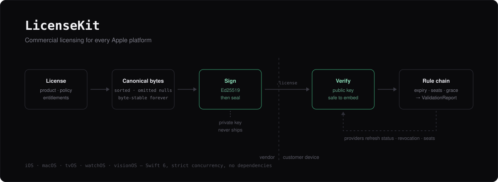

<p align="center">
  
</p>

<p align="center">
  <a href="#requirements"></a>
  <a href="#requirements"></a>
  <a href="#requirements"></a>
  <a href="LICENSE"></a>
  <a href="docs/"></a>
</p>

<p align="center">
  <a href="docs/getting-started.md">Getting started</a> ·
  <a href="docs/licensing-model.md">Licensing model</a> ·
  <a href="docs/providers.md">Providers</a> ·
  <a href="docs/issuing.md">Issuing</a> ·
  <a href="docs/architecture.md">Architecture</a> ·
  <a href="docs/troubleshooting.md">Troubleshooting</a>
</p>

---

**LicenseKit** is a Swift SDK for selling software: define licenses in code, issue
them as signed files, validate them offline or against a store's API, and gate
features on what a customer actually bought.

It is built around one rule, and everything else follows from it:

> **The core domain describes what a license *is*. It has no opinion about where
> a license came from.**

`LicenseKitCore` compiles with no networking, no cryptography, and no persistence.
That is not tidiness — it is the mechanism. Gumroad, Polar, HTTP, CryptoKit, and
the Keychain enter through protocol seams and cannot leak inward, because the core
has no vocabulary to express them. Adding a provider means writing one file and
changing nothing else.

The alternative is the shape most licensing code drifts into: an `if provider ==`
here, a Paddle-shaped optional there, until a pricing change means touching
validation, storage, and models at once.

## What it does

- **Define licenses programmatically** — perpetual, subscription, trial, or your own kind
- **Issue signed license files**, optionally encrypted, from a CLI or your own backend
- **Validate offline** with an embedded public key — no server required
- **Read license tables from CSV** for site licenses and volume purchases
- **Talk to license providers** through adapters (Gumroad and Polar included)
- **Gate features on entitlements**, with seats, grace periods, and version bounds

## Install

**Xcode:** File ▸ Add Package Dependencies…, then paste
`https://github.com/atcharm/LicenseKit-SDK.git`.

**Package.swift:**

```swift
dependencies: [
    .package(url: "https://github.com/atcharm/LicenseKit-SDK.git", from: "1.0.1")
],
targets: [
    .target(name: "YourApp", dependencies: [
        .product(name: "LicenseKit", package: "LicenseKit-SDK")
    ])
]
```

That is the whole setup. LicenseKit ships as prebuilt XCFrameworks, statically
linked, so there is nothing to embed and nothing to sign. Resolving the package
downloads only the version you asked for.

<details>
<summary>Pinning a binary target directly</summary>

If you vendor binary targets by hand rather than depending on the package:

```swift
.binaryTarget(
    name: "LicenseKit",
    url: "https://github.com/atcharm/LicenseKit-SDK/releases/download/1.0.1/LicenseKit.xcframework.zip",
    checksum: "b43081c4f4f6eae505ac2a729312c2a0c9266bb0c73af3489003a44b4fd40738"
)
```

Every module is published this way. Checksums for all of them are in
[`checksums.txt`](https://github.com/atcharm/LicenseKit-SDK/releases/download/1.0.1/checksums.txt),
attached to each release, and in the `.binaryTarget` entries in `Package.swift`.

</details>

<details>
<summary>Installing the <code>licensekit</code> command-line tool</summary>

You need this only to issue licenses — apps that merely validate them do not.

```sh
curl -fsSLO https://github.com/atcharm/LicenseKit-SDK/releases/download/1.0.1/licensekit.artifactbundle.zip
unzip -q licensekit.artifactbundle.zip
install licensekit.artifactbundle/licensekit-1.0.1-macos/bin/licensekit /usr/local/bin/
licensekit --help
```

macOS only, signed with a Developer ID. It is the same code as the
`LicenseKitVendor` library, so use whichever fits — a shell script or your own
Swift backend.

</details>

## Try it in two minutes

With the CLI installed, mint a license and then watch it refuse to be edited:

```sh
licensekit keygen --key-id demo --out ./keys

licensekit issue \
  --signing-key-file ./keys/demo.private --key-id demo \
  --product com.example.app --issuer com.example.licensing \
  --expires 2027-12-31 --entitlements "export.pdf" \
  --out demo.license

licensekit inspect --in demo.license
licensekit verify  --in demo.license \
  --public-key "$(cat ./keys/demo.public)" --key-id demo
```

Now change a single byte of `demo.license` in a text editor and run `verify`
again. That rejection is the whole product.

## Or run the demo app

`Examples/LicenseKitDemo` is a real macOS app that integrates this package the
same way yours will — through the released XCFrameworks, no source checkout.

```sh
cd Examples/LicenseKitDemo
swift run LicenseKitDemo    # the app
swift test                  # 50 integration tests, no network
```

It licenses a fictional photo editor, and a stand-in licensing service runs
in-process so you can break the backend on demand: revoke a purchase, exhaust the
seats, drop the network, return a malformed body. The Status screen shows the
rule-by-rule `ValidationReport` behind every verdict, and the Setup screen rebuilds
the configuration live so you can watch one license be accepted or rejected purely
because the host changed its mind about verification.

Start reading at `Sources/LicenseKitDemo/DemoRuntime.swift` — that one function is
the entire integration. See [its README](Examples/LicenseKitDemo/README.md) for a
guided tour.

## Quick start

Three steps: generate keys once, issue a license per customer, validate on device.

### 1. Generate vendor keys — once, ever

```sh
licensekit keygen --key-id vendor-2026 --out ./keys
```

You get a `.public` key to embed in your app and a `.private` key to guard. Losing
the private key means you can never issue another license that existing apps
accept; leaking it means anyone can.

### 2. Issue a license

From the CLI, or from your own fulfilment backend:

```swift
import LicenseKitVendor   // vendor-side only, never in the app

let issuer = LicenseIssuer(signingKey: signingKey)

let file = try issuer.issueFile(
    .subscription(
        product: ProductReference(id: "com.example.app", name: "Example App"),
        issuer: "com.example.licensing",
        expiresAt: renewalDate,
        subject: LicenseSubject(name: "Jane Smith", email: "jane@example.com"),
        entitlements: [
            Entitlement(id: "export.pdf"),
            Entitlement(id: "sync.cloud", limit: 3),   // three devices
        ],
        seats: 3
    )
)
```

> **Never link `LicenseKitVendor` into a shipping app.** It holds the private
> signing key type — the thing that mints licenses for your product. It is a
> separate product precisely so that mistake takes a deliberate act rather than an
> autocompleted import, and it has no iOS slice at all, so an iOS app cannot link
> it even by accident.

### 3. Validate it in your app

```swift
import LicenseKit

let configuration = try LicenseKitConfiguration.offline(
    product: "com.example.app",
    // Public keys are not secret. Embedding one discloses nothing and cannot
    // be used to forge anything. Take more than one and you can rotate later.
    publicKeys: [(id: "vendor-2026", base64: "<contents of vendor-2026.public>")],
    store: try FileLicenseStore.applicationSupport(subdirectory: "com.example.app"),
    fingerprintSalt: "example-app-2026"
)

let licensing = LicenseManager(configuration: configuration)
await licensing.start()          // restores and revalidates any stored license
```

Install a file the customer received:

```swift
try await licensing.installLicenseFile(data)
```

### 4. Gate features

```swift
if await licensing.isEntitled(to: "export.pdf") {
    enablePDFExport()
}
```

`isEntitled(to:)` answers `false` for a license that is absent **or invalid**, so a
forgotten status check degrades into a locked feature rather than a free one. The
failure mode of getting this wrong is a paywall bypass, so the safe answer is
built into the call.

### 5. Show state in SwiftUI

```swift
@MainActor @Observable
final class LicenseModel {
    private(set) var state: LicenseState = .unlicensed

    func observe(_ licensing: LicenseManager) async {
        for await state in await licensing.stateUpdates() {
            self.state = state
        }
    }
}
```

```swift
switch model.state {
case .unlicensed:
    ActivationView()
case .licensed(_, let report) where report.isRunningOnGrace:
    ContentView().banner(report.summary)      // "The license expires in 3 days."
case .licensed:
    ContentView()
case .invalid(_, let report):
    // The record is kept, so you can name which license failed and offer a fix.
    ProblemView(message: report.summary, reasons: report.failures)
}
```

Note the fourth case. Validation returns a **`ValidationReport`, not a `Bool`**,
because a licensing UI has to explain itself: "expired" wants a renewal button,
"machineMismatch" wants a deactivate-elsewhere flow, "signatureInvalid" wants
neither. A boolean throws away the only information that makes the screen useful.

## Connect a store

```swift
let gumroad = RemoteLicenseProvider(
    adapter: GumroadAdapter(
        productID: "abc123",
        product: ProductReference(id: "com.example.app"),
        grantedEntitlements: [Entitlement(id: "export.pdf")]
    )
)

let configuration = LicenseKitConfiguration(
    product: "com.example.app",
    verifier: verifier,
    store: store,
    providers: [gumroad],
    validator: .connectedDefault()
)

try await licensing.activate(key: "GUM-0001")
```

`PolarAdapter` ships too. Writing your own is one file — an adapter is pure
translation between HTTP and the domain, with no I/O, no retries, and no policy.
`RemoteLicenseProvider` owns all of that once, for every adapter, so a retry bug
gets fixed in one place instead of once per integration.

See **[docs/providers.md](docs/providers.md)** for the full guide.

## What a license carries

```swift
License
├─ id, key, product, subject          who, and what they bought
├─ policy
│  ├─ kind                            perpetual · subscription · trial · custom
│  ├─ validity                        notBefore / expiresAt
│  ├─ seats                           max activations, transferable
│  ├─ versionBound                    perpetual-fallback version ceiling
│  ├─ offlineGraceInterval            how long it runs without a provider
│  └─ expiryGraceInterval             how long it runs past expiry
├─ entitlements                       capabilities, each with an optional limit
├─ issuance                           issuer, issuedAt, schema version
└─ metadata                           open key/value bag
```

Entitlements are deliberately separate from the license *kind*, so you can
restructure pricing without touching feature-gating code. "Pro" is a marketing
concept that will change; `"export.pdf"` is a code concept that will not.

`versionBound` exists because the perpetual-fallback arrangement — you keep the
versions you paid for, upgrades need a renewal — cannot be modelled with an expiry
date without disabling software the customer legitimately owns.

Both grace intervals exist for the same kind of reason:
`expiryGraceInterval` absorbs a card that declines on a Friday;
`offlineGraceInterval` bounds how long a cached "valid" answer survives, which is
what makes revocation mean anything.

## Documentation

| Guide | What is in it |
|---|---|
| [Getting started](docs/getting-started.md) | Install, first license, wiring it into an app, verification checklist |
| [Licensing model](docs/licensing-model.md) | Every field, what to reach for, and how to model real pricing |
| [Validation](docs/validation.md) | The rule chain, all nine built-in rules, reports, warnings, custom rules |
| [Providers](docs/providers.md) | Writing an adapter, Gumroad, Polar, capabilities, retries, testing |
| [Issuing](docs/issuing.md) | Keys, rotation, signing, sealing, CSV import, full CLI reference |
| [Storage](docs/storage.md) | File vs Keychain, custom stores, what is safe to persist |
| [Architecture](docs/architecture.md) | The layer split, the five seams, the canonical form, concurrency |
| [Security](docs/security.md) | Threat model, what is and is not defended, key handling, redaction |
| [Recipes](docs/recipes.md) | Trials, subscriptions, site licenses, seat management, migration |
| [Troubleshooting](docs/troubleshooting.md) | ~40 symptom → cause → fix entries |

## Requirements

- **iOS 15+ · macOS 12+ · tvOS 15+ · watchOS 8+ · visionOS 1+** — the floor is set
  by `AsyncStream` and structured concurrency, which keeps the source free of
  availability branches.
- **Swift 6.0+**, built in Swift 6 language mode with strict concurrency. Every
  public type is `Sendable`.
- **No dependencies.** A licensing SDK is a security-relevant component, and every
  third-party package in its graph is one more thing you have to audit and trust.

Verified on macOS and iOS. The tvOS, watchOS, and visionOS slices are built and
shipped, and the platform-specific surface is small — device identity only — but
test them on your own targets before shipping.

### One API note

LicenseKit is built with library evolution enabled, which is what lets these
frameworks be consumed by a newer compiler than they were built with. Under
library evolution, a `switch` over a public enum that is not `@frozen` needs an
`@unknown default` case:

```swift
switch failure {
case .expired:          showRenewal()
case .signatureInvalid: showTampered()
@unknown default:       showGenericProblem()
}
```

This applies to the error and failure-reason taxonomies, which are the ones that
gain cases over time. The types you branch on daily — `LicenseState` among them —
are `@frozen` and switch exhaustively with no extra case.

## Testing

Every non-deterministic input is injected — time, device identity, networking,
persistence — so your licensing tests have no wall-clock sensitivity and never
touch the network:

```swift
let manager = LicenseManager(configuration: LicenseKitConfiguration(
    product: "com.example.app",
    verifier: CryptoKitLicenseVerifier(key: testPublicKey),
    store: InMemoryLicenseStore(),
    providers: [RemoteLicenseProvider(
        adapter: MyAdapter(),
        transport: StubHTTPTransport(always: .json(recordedResponse))
    )],
    machineIdentity: StaticMachineIdentity("test-machine"),
    clock: FixedLicenseClock(fixedInstant)
))
```

## Honest limits

A licensing SDK that oversells itself is worse than none, so, plainly:

- **No client-side SDK can stop a patched binary.** Someone willing to modify your
  app can remove the check. LicenseKit makes honest use easy and casual copying
  ineffective; it does not defeat a determined reverse engineer.
- **Encryption is not authentication.** A symmetric key shipped inside an app can
  be extracted. LicenseKit therefore *signs first and seals second*, so
  authenticity rests on a private key that never leaves your control.
- **Clock-rollback detection raises cost, not certainty.** It is defeatable by
  clearing local state, and that is the correct trade — the alternative punishes
  users whose clock is simply wrong.

[docs/security.md](docs/security.md) lays out the full threat model, including the
rows where the answer is "none".

## Support

Questions, bug reports, and adapter requests:
[open an issue](https://github.com/atcharm/LicenseKit-SDK/issues).

## License

**Proprietary.** See [LICENSE](LICENSE). Use in any product or internal system
requires a commercial agreement.
